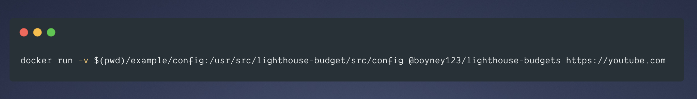

<div align="center">

<h2>lighthouse-budgets: A tool to quickly check performance metrics against budgets.</h2>

<p>
A simple Docker container that takes your budgets and a given url then checks to see if your website is below the your budgets. Easy to use and great for CI.
</p>

  <hr />

[](https://travis-ci.org/boyney123/lighthouse-budgets)
[](https://codecov.io/gh/boyney123/lighthouse-budgets)
[![MIT License][license-badge]][license]
[![PRs Welcome][prs-badge]][prs]

[Donate ☕](https://www.paypal.me/boyney123/5)

<hr />



  <h3>Features: Run with one command, override lighthouse configuration, set budgets and more...</h3>

[Read the Docs](https://lighthouse-budgets.netlify.com/) | [Edit the Docs](https://github.com/boyney123/lighthouse-budgets-docs)

</div>

<hr/>

# The problem

Lighthouse now supports budgets. To use this feature you can run this easily within a browser. But there is no easy way to run this on CI without creating your own docker image.

# This solution

This tool was designed to help developers quickly run performance budgets against any given website. `lighthouse-budgets` allows to to focus on your code and the performance rather than the setup of the tools surrounding it.

# Getting Started

_Make sure you have docker running_

```sh
git clone https://github.com/boyney123/lighthouse-budgets.git
```

```sh
cd lighthouse-budgets && docker build -t lighthouse-budgets .
```

```sh
docker run -v $(pwd)/example/config:/usr/src/lighthouse-budgets/src/config lighthouse-budgets {url}

#Example
docker run -v $(pwd)/example/config:/usr/src/lighthouse-budgets/src/config lighthouse-budgets https://youtube.com


```

Once you run the container, an instance of chrome will run inside the container with lighthouse installed. Lighthouse will take your given budget configuration file and make sure the website is within budget.

The docker container will exit with logs if you are over budget!

## Setting your own budgets

**TODO**

## Using as a GitHub Action

**TODO**

## Overriding Lighthouse Configuration

_TODO_

# Tools

- [lighthouse](https://github.com/GoogleChrome/lighthouse)
- [chrome-launcher](https://github.com/GoogleChrome/chrome-launcher)

## Testing

- [jest](https://jestjs.io/)

# Contributing

If you have any questions, features or issues please raise any issue or pull requests you like.

[spectrum-badge]: https://withspectrum.github.io/badge/badge.svg
[spectrum]: https://spectrum.chat/explore-tech
[license-badge]: https://img.shields.io/github/license/boyney123/lighthouse-budgets.svg?color=yellow
[license]: https://github.com/boyney123/react.explore-tech.org/blob/master/LICENSE
[prs-badge]: https://img.shields.io/badge/PRs-welcome-brightgreen.svg?style=flat-square
[prs]: http://makeapullrequest.com
[github-watch-badge]: https://img.shields.io/github/watchers/boyney123/lighthouse-budgets.svg?style=social
[github-watch]: https://github.com/boyney123/lighthouse-budgets/watchers
[twitter]: https://twitter.com/intent/tweet?text=Check%20out%20lighthouse-budgets%20by%20%40boyney123%20https%3A%2F%2Fgithub.com%2Fboyney123%2Flighthouse-budgets%20%F0%9F%91%8D
[twitter-badge]: https://img.shields.io/twitter/url/https/github.com/boyney123/lighthouse-budgets.svg?style=social
[github-star-badge]: https://img.shields.io/github/stars/boyney123/lighthouse-budgets.svg?style=social
[github-star]: https://github.com/boyney123/lighthouse-budgets/stargazers

# Donating

If you find this tool useful, feel free to buy me a ☕ 👍

[Buy a drink](https://www.paypal.me/boyney123/5)

# License

MIT.
