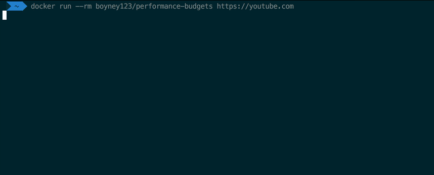

<div align="center">

<h1>performance-budgets: Keep your apps ⚡ with budgets</h1>

[](https://travis-ci.org/boyney123/performance-budgets)
[](https://codecov.io/gh/boyney123/performance-budgets)
[![MIT License][license-badge]][license]
[![PRs Welcome][prs-badge]][prs]

<hr/>

### _Check budgets with one command..._

```sh
docker run --rm boyney123/performance-budgets https://example.com
```



  <h3>Features: Set performance budgets, override lighthouse configuration, easily run on CI, and more... </h3>
  
  [Read the Docs](https://performance-budgets.netlify.com/) | [Edit the Docs](https://github.com/boyney123/performance-budgets)

</div>

<hr/>

## The problem

Every feature we add has an impact on the performance of our applications and can effect the end user experience. Performance budgets are a great way to keep your applications fast.

There is currently a lot of work going on around web performance and some new awesome features coming out.

- https://web.dev/performance-budgets-101/
- https://addyosmani.com/blog/performance-budgets/
- https://web.dev/your-first-performance-budget/
- https://web.dev/incorporate-performance-budgets-into-your-build-tools/

[Addy Osmani has written a great article on performance budgets](https://addyosmani.com/blog/performance-budgets/), and he says...

> Performance budgets usher a culture of accountability that enable stakeholders to weigh the impact to user-centric metrics of each change to a site. Talk to your organization and see if you can get by in to adopt performance budgets for your projects. If it's worth getting fast, it's worth staying fast. ❤️

[Lighthouse](https://developers.google.com/web/tools/lighthouse/) has recently come out with a [great feature](https://developers.google.com/web/tools/lighthouse/audits/budgets) that allows you to capture and set budgets on a given website.

## This solution

`performance-budgets` was built from inspiration from these articles and built to give developers an easy way to get started with performance budgets.

`performance-budgets` was built with continuous-integration in mind, allowing developers to run one command to check budgets against any given url.

_In the future we hope to add more features to the project and start to monitor other stats._

## Documentation

- [Getting Started](https://performance-budgets.netlify.com/docs/getting-started/installation)
- [Setting up Custom Budgets](https://performance-budgets.netlify.com/docs/getting-started/config)
- [Understanding Budgets](https://performance-budgets.netlify.com/docs/getting-started/config#understanding-budgets)
- [Contributing](https://performance-budgets.netlify.com/docs/contributing/contributing)

## Tools

- [lighthouse](https://github.com/GoogleChrome/lighthouse)
- [chrome-launcher](https://github.com/GoogleChrome/chrome-launcher)

### Testing

- [jest](https://jestjs.io/)

## Contributing

If you have any questions, features or issues please raise any issue or pull requests you like.

[spectrum-badge]: https://withspectrum.github.io/badge/badge.svg
[spectrum]: https://spectrum.chat/explore-tech
[license-badge]: https://img.shields.io/github/license/boyney123/performance-budgets.svg
[license]: https://github.com/boyney123/performance-budgets/blob/master/LICENSE
[prs-badge]: https://img.shields.io/badge/PRs-welcome-brightgreen.svg?style=flat-square
[prs]: http://makeapullrequest.com
[github-watch-badge]: https://img.shields.io/github/watchers/boyney123/performance-budgets.svg?style=social
[github-watch]: https://github.com/boyney123/performance-budgets/watchers
[twitter]: https://twitter.com/intent/tweet?text=Check%20out%20performance-budgets%20by%20%40boyney123%20https%3A%2F%2Fgithub.com%2Fboyney123%2Fperformance-budgets%20%F0%9F%91%8D
[twitter-badge]: https://img.shields.io/twitter/url/https/github.com/boyney123/performance-budgets.svg?style=social
[github-star-badge]: https://img.shields.io/github/stars/boyney123/performance-budgets.svg?style=social
[github-star]: https://github.com/boyney123/performance-budgets/stargazers

# Donating

If you find this tool useful, feel free to buy me a ☕ 👍

[Buy a drink](https://www.paypal.me/boyney123/5)

# License

MIT.
